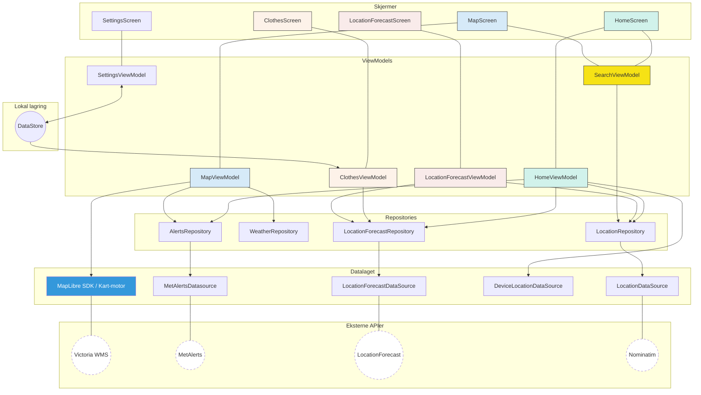

# Oversikt over arkitekturen i T-skjortevær
## Arkitekturskisse

Arkitekturskissen illustrerer den overordnede flyten og sammenhengen mellom komponentene i appen. 
## Mappestruktur
```
app/src/main/java/no/uio/ifi/in2000/ieulrich/team32/
│
├── MainActivity.kt               <- Inngangspunkt, håndterer lokasjonstillatelse
├── MyApp.kt                      <- Hilt application-klasse
│
├── data/                         <- Datalaget — all kommunikasjon med API og enheten
│   ├── client/
│   │   └── NetworkMonitor.kt     <- Overvåker nettverkstilkobling (StateFlow<Boolean>)
│   ├── geocoding/                <- Stedsnavnoppslag via Nominatim
│   │   ├── dto/
│   │   │   ├── NominatimAddress.kt
│   │   │   ├── NominatimResponse.kt
│   │   │   └── NominatimSearchResult.kt
│   │   ├── LocationDatasource.kt
│   │   └── LocationRepository.kt
│   ├── location/                 <- GPS-posisjon fra enheten
│   │   └── DeviceLocationDataSource.kt
│   ├── locationForecast/         <- LocationForecast 2.0 (MET via IFI-proxy)
│   │   ├── dto/                  <- Rå API-responsobjekter
│   │   │   ├── Data.kt
│   │   │   ├── Geometry.kt
│   │   │   ├── Instant.kt
│   │   │   ├── InstantDetails.kt
│   │   │   ├── LocationForecastResponse.kt
│   │   │   ├── Meta.kt
│   │   │   ├── NextHours.kt
│   │   │   ├── PrecipitationDetails.kt
│   │   │   ├── Properties.kt
│   │   │   ├── Summary.kt
│   │   │   ├── TimeSeries.kt
│   │   │   └── Units.kt
│   │   ├── mapper/
│   │   │   └── ForecastMapper.kt          <- DTO til domenemodell
│   │   ├── LocationForecastDataSource.kt  <- HTTP-kall + If-Modified-Since caching
│   │   └── LocationForecastRepository.kt
│   ├── metAlert/                          <- MetAlerts (MET via IFI-proxy)
│   │   ├── MetAlertsDatasource.kt
│   │   └── MetAlertsRepository.kt
│   └── weather/                  <- Victoria WMS-kartlag
│       └── WeatherRepository.kt  <- WMS-URL-bygging
│
├── di/                           <- Hilt dependency injection-moduler
│   ├── NetworkModule.kt          <- HttpClient, FusedLocationProviderClient, DataStore
│   └── RepositoryModule.kt       <- Binder interface til implementasjon
│
├── model/                        <- Domeneobjekter som brukes på tvers av lag
│   ├── clothes/
│   │   ├── ActivityLevel.kt
│   │   └── ClothesRecommendationEngine.kt
│   ├── location/
│   │   └── AppLocation.kt
│   ├── locationForecast/
│   │   └── ForecastHourDetails.kt
│   ├── metAlerts/
│   │   ├── MetAlert.kt
│   │   └── MetAlertExtensions.kt
│   └── weather/
│       └── WeatherLayer.kt
│
├── ui/                           <- UI-laget (Jetpack Compose)
│   ├── components/               <- Gjenbrukbare Compose-komponenter
│   │   ├── ForecastHour.kt
│   │   ├── SearchBar.kt
│   │   ├── TimeComponents.kt
│   │   ├── TopAppBar.kt
│   │   ├── TravelTimesCard.kt
│   │   └── WindDirectionArrow.kt
│   ├── screens/                  <- Én fil per navigasjonsdestinasjon
│   │   ├── AlertDetailScreen.kt
│   │   ├── ClothesScreen.kt
│   │   ├── ErrorScreen.kt
│   │   ├── HomeScreen.kt
│   │   ├── LocationForecastScreen.kt
│   │   ├── MapScreen.kt
│   │   └── SettingsScreen.kt
│   ├── theme/
│   │   ├── Color.kt
│   │   ├── Theme.kt
│   │   └── Type.kt
│   ├── util/
│   │   └── Format.kt             <- Formateringshjelpere (temperatur, tid, vind)
│   ├── MapApp.kt                 <- NavHost, Scaffold, nettverksovervåking
│   └── Routes.kt                 <- Navigasjonskonstanter og Destination-enum
│
└── viewmodel/                    <- Én ViewModel per skjerm
    ├── ClothesViewModel.kt
    ├── HomeViewModel.kt
    ├── LocationForecastViewmodel.kt
    ├── MapViewModel.kt
    ├── SearchViewModel.kt
    └── SettingsViewModel.kt
```
### Data
Vi har plassert datalaget i en egen mappe i prosjektet. Her har vi videre delt inn i egne mapper per datakilde. Hver av disse har som hovedregel en datasource og et repository. Unntakene er weather-mappen, hvor vi kun har et repository, og location, hvor vi kun har en datasource. 
#### data/*/dto
I noen av undermappene for datakildene har vi også en mappe for data transfer objects. Dette er data-klasser som nøyaktig matcher responsformatet fra API-ene våre. Disse blir som hovedregel ikke brukt andre steder i koden. 
#### data/*/mapper/
I locationforecast har vi også en mapper-mappe. Her har vi en mapper som transformerer DTO til domenemodellen vår. 
#### data/client/Networkmonitor
Her ligger nettverksovervåkningen vår. 
### di
I di-mappen ligger Hilt-moduler for dependency injection. 

### model
I model ligger domenmodellene våre. 
### ui
I ui-mappen ligger alle composables. 
#### ui/screens
Her ligger alle skjermene våre. En per destinasjon. I tillegg har en errorscreen som brukes på tvers av destinasjoner, og en AlertDetailScreen som brukes på tvers av HomeScreen og MapScreen. 
#### ui/components
Her ligger gjenbrukbare ui-komponenter
#### ui/util
Her ligger Format.kt, som inneholder formateringshjelpere for temperatur, tid og vind som brukes på tvers av skjermer.

### viewmodel
Her ligger alle viewmodelene våre, en per skjerm og en egen for søk. 

## MVVM og UDF
- UI samler tilstand med collectAsStateWithLifecycle() og behandler brukerhandlinger som funksjonskall til ViewModel
- ViewModel eksponerer tilstand som StateFlow, aldri rå dataklasser eller suspend-funksjoner
- Repository er eneste inngang til data for ViewModels — ViewModels kjenner ikke til datakilder direkte. Unntaket er `DeviceLocationDataSource`, som injiseres direkte i `HomeViewModel` uten et repository-lag. Dette er et bevisst valg - enhetsposisjonen trenger ikke caching eller abstraksjon på samme måte som API-kall, og et ekstra repository-lag ville bare ført til unødvendig kompleksitet.
- Datakilder håndterer HTTP-kall og caching (eks. If-Modified-Since i LocationForecastDataSource)

## Lav kobling, høy kohesjon
- Hilt sørger for at avhengigheter injiseres, ikke hardkodes — ingen klasser oppretter sine egne avhengigheter
- WeatherRepository er et interface; WeatherRepositoryImpl er den konkrete implementasjonen — lett å bytte ut eller mocke i tester. Ideelt sett burde dette egentlig vært gjort for alle repositories. 
- Hver ViewModel kjenner kun til de repositoriene den trenger
- UI-komponenter mottar kun primitiver og callbacks, ikke ViewModels - med unntak av ClothesViewModel, som deles mellom HomeScreen og ClothesScreen for å unngå å hente data dobbelt opp. 

## API-nivå
| | |
|---|---|
| `minSdk` | 24 (Android 7.0 Nougat) |
| `targetSdk` | 35 (Android 15) |

Fordi det er et forsvinnende lite antall enheter med API-level lavere enn 24 (nøyaktige tall er vanskelige å finne uten tilgang til google play console), og det hadde krevd en del workarounds for noe av funksjonaliteten vår, har vi valgt å ikke støtte noe lavere enn dette.

## Teknologier 
| Teknologi | Bruk |
|---|---|
| Jetpack Compose | UI |
| Hilt | Dependency injection |
| Ktor CIO | HTTP-klienter |
| kotlinx.serialization | JSON-parsing |
| Navigation Compose | Navigasjon mellom skjermer |
| DataStore Preferences | Lagring av brukerinnstillinger |
| MapLibre | Kartvisning og WMS-kartlag |
| Coil 3 + SVG-dekoder | Asynkron bildelasting (værsymboler) |
| Play Services Location | GPS-posisjonering via FusedLocationProviderClient |

## For videreutvikling
- Alle MET-kall skal gå via IFI-proxyen (in2000.api.met.no), ikke direkte til api.met.no 
- ClothesViewModel abonnerer på DataStore direkte — endringer i innstillinger reflekteres automatisk uten manuell synkronisering 
- NetworkMonitor i MapApp styrer et wasOffline-flagg som brukes til å laste data på nytt etter nettverkstap 
- Nye skjermer legges til i NavHost i MapApp.kt og som konstant i Routes
- WeatherRepositorys eneste oppgave per nå er å returnere url-strenger til mapviewmodel, som brukes for å laste data i maplibre. 
