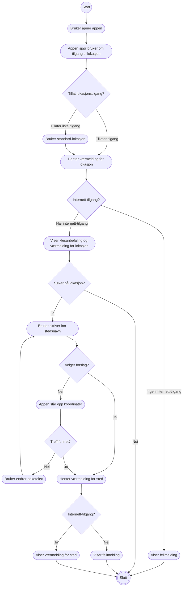
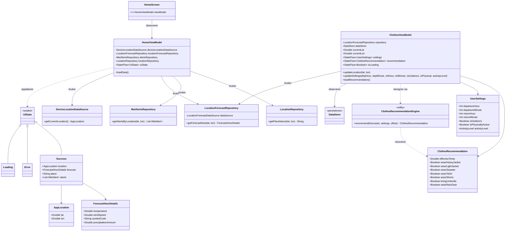
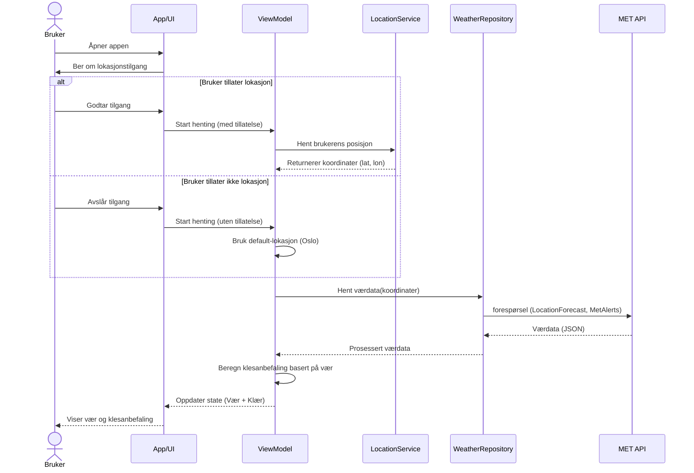

# Modellering for T-skjortevær

## User stories
Vi har samlet noen user stories som konkretiserer noen av de sentrale funksjonelle kraven i appen. 
1. Som student vil jeg vite hva jeg burde ha på meg når jeg pendler til universitetet så jeg føler meg komfortabel
2. Som danser vil jeg kunne tilpasse klesanbefalingen min etter aktivitetsnivå så jeg ikke blir for varm
3. Som student vil jeg kunne tilpasse reisetidene mine så jeg får en klesanbefaling tilpassset mine behov
4. Som en frysepinne vil jeg kunne tilpasse innstillenger så jeg får klesanbefalinger tilpasset hvor kald jeg føler meg, så jeg slipper å fryse
   
## Tekstlige use case
### Klesanbefaling
Primæraktør: Bruker \
Sekundæraktør: LocationForecast, MetAlerts \
Prebetingelser: Bruker har installert appen T-skjortevær på sin enhet \
Postbetingelser: Bruker har fått vist en klesanbefaling basert på værvarselet for sin posisjon

##### Hovedflyt
1. Bruker åpner appen 
2. Appen ber om tilgang til lokasjon
3. Bruker tillater lokasjonstilgang
4. Appen henter brukerens posisjon
5. Appen viser været, mulige farevarsler og klesanbefaling basert på brukerens posisjon

##### Alternativ flyt punkt 3
3.1 Bruker tillater ikke lokasjonstilgang \
3.2 Appen går videre med default-lokasjon (Oslo) 

##### Alternativ flyt punkt 5
5.1 Appen får ikke hentet data fra API \
5.2 Appen viser feilmelding om manglende internettforbindelse

### Søk på sted
Primæraktør: Bruker \
Sekundæraktør: Nominatim, Locationforecast \
Prebetingelser: Bruker har installert appen T-skjortevær på sin enhet \
Postbetingelser: Bruker har fått vist værmelding for stedet den søkte opp

##### Hovedflyt
1. Bruker åpner appen 
2. Bruker trykker i søkefeltet på hjemskjermen 
3. Bruker taster inn "oslo" 
4. Appen viser forslag basert på søketeksten 
5. Bruker trykker på et av forslagene 
6. Appen henter værmelding for det valgte stedet fra LocationForecast
7. Appen viser værmelding for stedet

##### Alternativ flyt – punkt 4
4.1 Bruker trykker søk uten å velge et forslag \
4.2 Appen slår opp koordinater for søketeksten direkte \
4.3 Appen fortsetter til punkt 6

##### Alternativ flyt – punkt 4 (ingen treff)
4.1 Nominatim finner ingen koordinater for søketeksten \
4.2 Appen viser ingen værmelding \
4.3 Bruker kan endre søketeksten og prøve på nytt

##### Alternativ flyt – punkt 6
6.1 Appen får ikke hentet data (ingen internettforbindelse) \
6.2 Appen viser feilmelding om manglende internettforbindelse

## Aktivitetsdiagram

Aktivitetsdiagrammet er basert på de tekstlige use casene over kombinert. 
## Klassediagram

Viser delene av kodebasen som er relevante for use case klesanbefaling
## sekvensdiagram

## Use Case Diagram
Her har vi laget et Use Case Diagram. Et Use Case Diagram viser målene til primæraktøren og hvordan sekundæraktører hjelper med å nå dette målet gjennom systemet. Dette diagrammet er laget til use caset  «klesanbefaling». 

