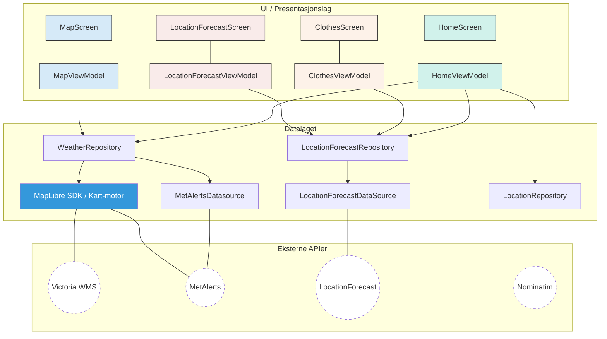
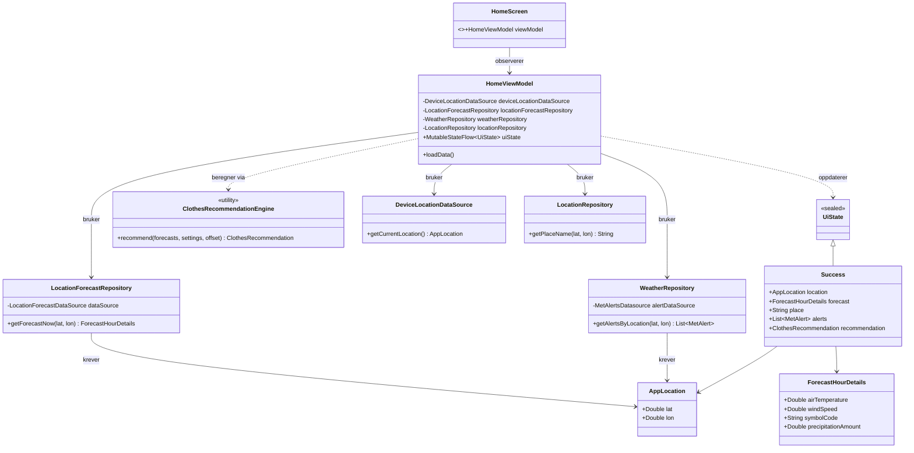
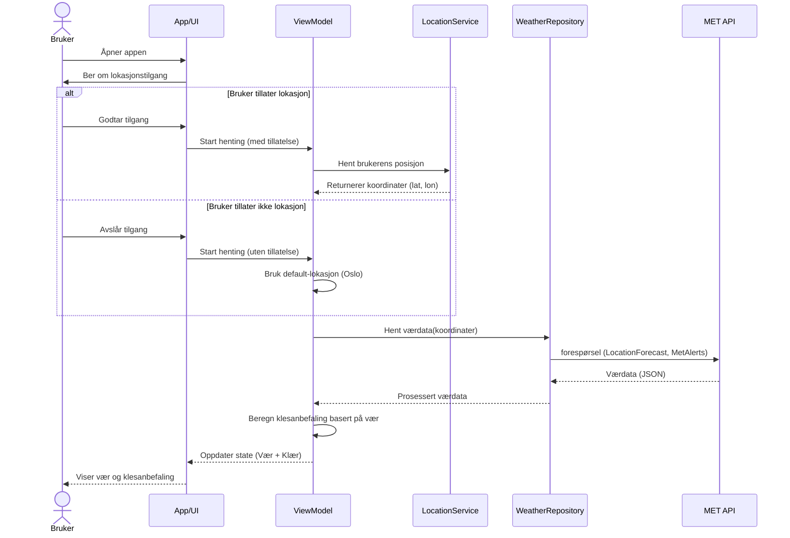

# Modellering for T-skjortevær

## Arkitekturskisse

## Tekstlige use case
### Klesanbefaling
Primæraktør: Bruker
Sekundæraktør: LocationForecast, MetAlerts
Prebetingelser: Bruker har installert appen T-skjortevær på sin enhet
Postbetingelser: Ingen

##### Hovedflyt
1. Bruker åpner appen 
2. Appen ber om tilgang til lokasjon
3. Bruker tillatter lokasjonstilgang
4. Appen henter brukerens posisjon
5. Appen viser været, mulige farevarsler og klesanbefaling basert på brukerens posisjon

##### Alternativ flyt punkt 3
3.1 Bruker tillater ikke lokasjonstilgang
3.2 Appen går videre med default-lokasjon (Oslo)

### Søk på sted
Primæraktør: Bruker
Sekundæraktør:
Prebetingelser: Bruker har installert appen T-skjortevær på sin enhet
Postbetingelser: Ingen

##### Hovedflyt

##### Alternativ flyt punkt 

## Klassediagram

## sekvensdiagram

## Use-case diagram

